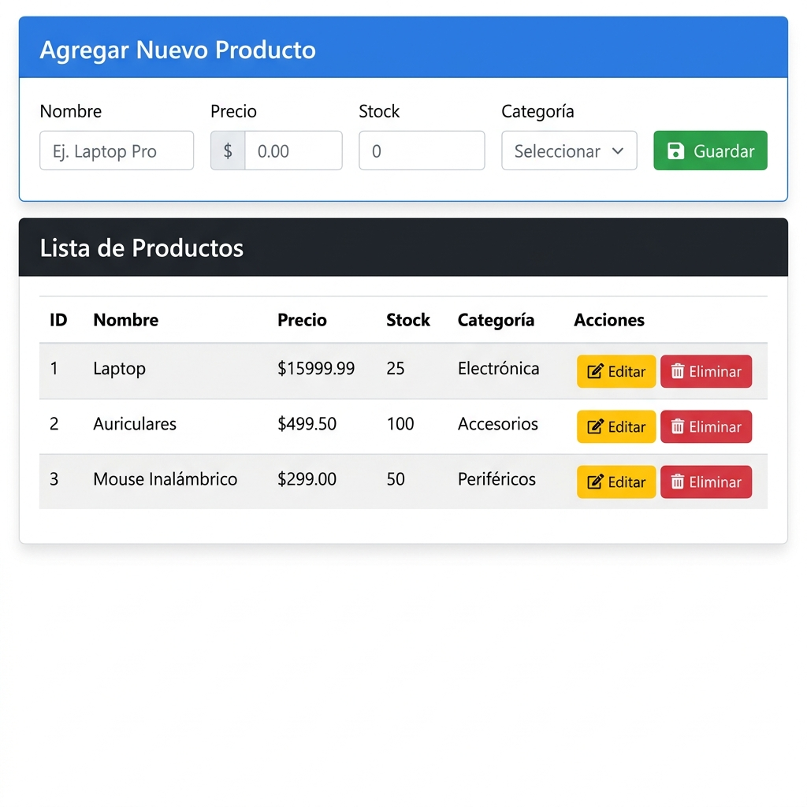
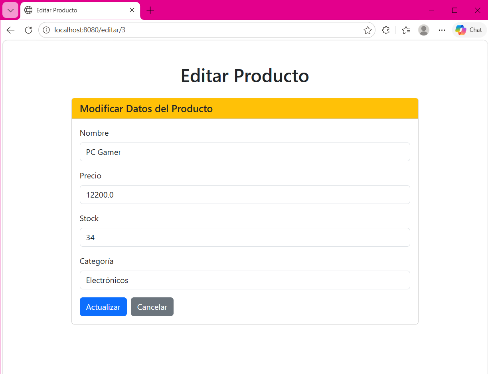

# CRUD Productos — Gestión de Productos con Spring Boot

## Descripción

Aplicación web tipo CRUD (Crear, Consultar, Editar, Eliminar) para la gestión de **Productos**, desarrollada con **Spring Boot**, **Spring Data JPA**, **Thymeleaf** y **MySQL**. La aplicación permite administrar un catálogo de productos a través de una interfaz web limpia.

La base de datos se genera automáticamente al ejecutar la aplicación gracias a la propiedad `spring.jpa.hibernate.ddl-auto=update`, por lo que solo es necesario crear la base de datos vacía en MySQL.

---

## Tecnologías Utilizadas

| Tecnología | Versión | Uso |
|------------|---------|-----|
| **Java** | 17 | Lenguaje de programación |
| **Spring Boot** | 4.0.6 | Framework backend |
| **Spring Data JPA** | - | Acceso a datos y ORM |
| **Thymeleaf** | - | Motor de plantillas HTML |
| **MySQL** | 8.x | Base de datos relacional |
| **Bootstrap** | 5.3.0 | Framework CSS para la interfaz |
| **Maven** | - | Gestión de dependencias y build |

---

## Funcionalidades

- **Crear** — Registrar nuevos productos mediante un formulario con 4 campos.
- **Consultar** — Listar todos los productos en una tabla con todos sus datos.
- **Editar** — Modificar los datos de un producto existente a través de un formulario prellenado.
- **Eliminar** — Eliminar un producto con confirmación antes de borrar.

### Campos de la entidad Producto

| Campo | Tipo | Descripción |
|-------|------|-------------|
| `id` | Long (autoincremental) | Identificador único |
| `nombre` | String | Nombre del producto |
| `precio` | Double | Precio del producto |
| `stock` | Integer | Cantidad en inventario |
| `categoria` | String | Categoría del producto |

---

## Estructura del Proyecto

```
src/main/java/com/example/demo/
├── DemoApplication.java                  → Clase principal de Spring Boot
├── modelo/
│   └── Producto.java                     → Entidad JPA (tabla "producto")
├── repositorio/
│   └── ProductoRepository.java           → Repositorio JPA (operaciones CRUD)
└── controlador/
    └── ProductoController.java           → Controlador web (rutas HTTP)

src/main/resources/
├── application.properties                → Configuración de BD
└── templates/
    ├── index.html                        → Vista principal
    └── editar.html                       → Modal de edición
```

---

## Instrucciones para Ejecutar el Proyecto


- **Java 17** o superior instalado ([Descargar JDK](https://www.oracle.com/java/technologies/javase/jdk17-archive-downloads.html))
- **MySQL** instalado y en ejecución ([Descargar MySQL](https://dev.mysql.com/downloads/installer/))

### Paso 1: Clonar el repositorio

```bash
git clone https://github.com/TU_USUARIO/crud-productos-springboot.git
cd crud-productos-springboot
```

### Paso 2: Crear la base de datos en MySQL

Abre MySQL Workbench o la terminal de MySQL y ejecuta:

```sql
CREATE DATABASE crud_productos;
```

> **Nota:** La tabla `producto` se creará automáticamente al ejecutar la aplicación.

### Paso 3: Configurar las credenciales de MySQL

Edita el archivo `src/main/resources/application.properties` si tu usuario o contraseña son diferentes:

```properties
spring.datasource.url=jdbc:mysql://localhost:3306/nombre_de_tu_base_de_datos
spring.datasource.username=TU_USUARIO
spring.datasource.password=TU_PASSWORD
```

### Paso 4: Ejecutar la aplicación

Desde la carpeta raíz del proyecto:

**En Windows:**
```cmd
mvnw.cmd spring-boot:run
```


### Paso 5: Abrir en el navegador

Accede a: **http://localhost:8080**

---

## Evidencias / Capturas de Pantalla

### Página principal — Listar y Crear Productos



### Página de Edición — Modificar Producto



---

## Uso de IA

Se utilizó **IA (asistente de código)** como apoyo para:

- Generar base del código (Repositorio, Controlador).
- Crear las vistas HTML con Thymeleaf y Bootstrap.
- Redactar este archivo README.md.


---

## Rutas de la Aplicación

| Método | Ruta | Acción |
|--------|------|--------|
| `GET` | `/` | Listar productos + formulario de creación |
| `POST` | `/guardar` | Guardar un nuevo producto |
| `GET` | `/editar/{id}` | Mostrar formulario de edición |
| `POST` | `/actualizar/{id}` | Actualizar un producto existente |
| `GET` | `/eliminar/{id}` | Eliminar un producto |

---

## Autor
LORELEY CARRILLO JUAREZ 
